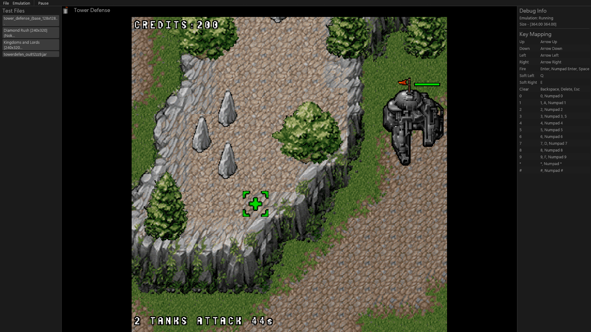
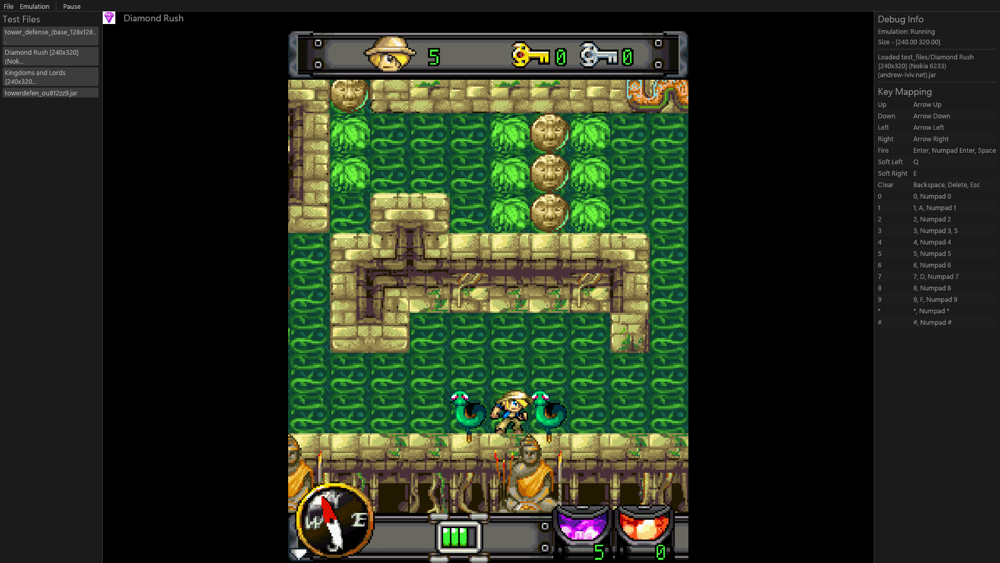

# J2ME Emulator

A simple emulator intended to run J2ME games on desktop.

### Capablities
- Scaling of the native resolution to fit the panel size.
- Plays audios (atleast for games i tried).
- Supports keyboard input
- I tried to keep it fast and performant.

### Screenshots

### Build and Run
- Clone the repository
- cd into the project directory
- Run with `cargo run`
